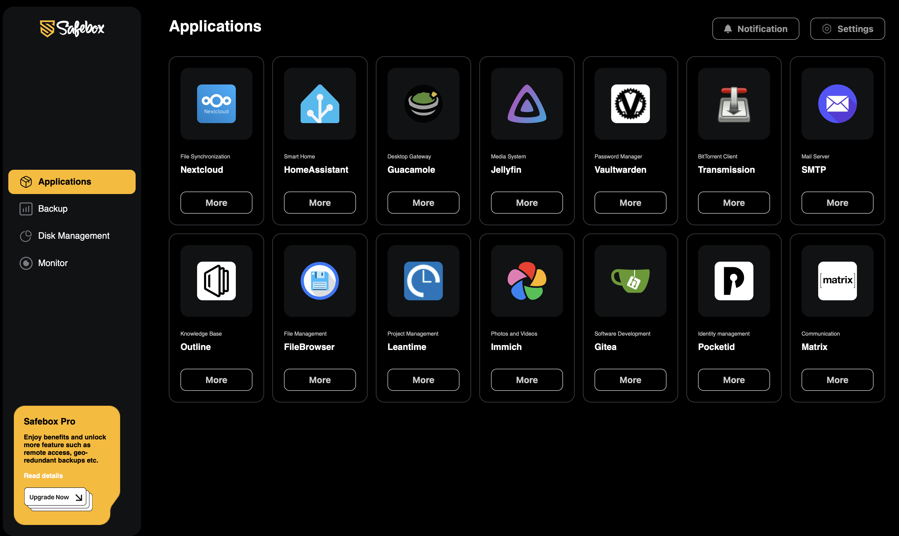

# Framework Scheduler

The Framework Scheduler is a component of the Safebox project, designed to manage and schedule tasks within a containerized environment.

## Description

Framework Scheduler is a lightweight, Alpine-based container that provides task scheduling and service management capabilities. It includes network scanning, service discovery, certificate management, and automated backup functionality for challenge clients.

### Dependencies
The Framework Scheduler is part of the Safebox platform. For full functionality, it also requires the `safebox/web-installer` image.
You can find the current version of the web-installer image on [Docker Hub](https://hub.docker.com/r/safebox/web-installer). The source code repository is available at [https://git.format.hu/safebox/web-installer](https://git.format.hu/safebox/web-installer).

## Screenshots


## How to Use

### Running the Container

```bash
docker run \
    --rm \
    -v /var/run/docker.sock:/var/run/docker.sock \
    safebox/framework-scheduler:latest
```

 ><p align=justify><i><b>Keep in mind!</b> that the Safebox platfrom requires an isolated Docker network which is automatically created when you run the `safebox/framework-scheduler` image for the first time. While running the container, it will check for the existence of this network and create it if it does not exist and also check the desired subnet availability. If you would like to specify a custom subnet for the Safebox network, you can set the <code>FRAMEWORK_SCHEDULER_NETWORK_SUBNET</code> environment variable when running the container or set the <code>RUN_FORCE=true</code> environment variable to force the creation of the network even if the desired subnet is not available.</i></p>


### Alternative way to deploy via command line
```bash
curl https://raw.githubusercontent.com/safeboxnetwork/framework-scheduler/refs/heads/main/development/installer.sh | bash
```

**Please note:** This method is recommended only for quick tests and development purposes. Avoid using it in production environments.

### Accessing the Web Interface
Once the container is running, you can access the web interface by navigating to `http://<host-ip>:8080` in your web browser. Replace `<host-ip>` with the IP address of the host machine where the container is running.

### Build Your Own Image
To build the Framework Scheduler image from the source code, follow these steps:
1. Clone the repository:
     ```bash
     git clone https://github.com/safebox/framework-scheduler.git
     cd framework-scheduler
     ```
2. Build the Docker image:
     ```bash
     docker build -t <your-docker-registry>/framework-scheduler:latest .
     ```
3. Run the container:
     ```bash
     docker run --rm -e DOCKER_REGISTRY_URL=<your-docker-registry> -v /var/run/docker.sock:/var/run/docker.sock <your-docker-registry>/framework-scheduler:latest
     ```
     > **Note:** Replace `<your-docker-registry>` with your actual Docker registry URL. Otherwise, the image will use the default Docker registry URL, 'safebox'.

### Environment Variables
The following environment variables can be set to configure the Framework Scheduler:

| Environment Variable | Description |
|--------------------------|-------------|
| `DOCKER_REGISTRY_URL` | Docker registry URL for image operations. Required for pushing to a private registry. |
| `DOCKER_REGISTRY_USERNAME` | Username for Docker registry authentication. |
| `DOCKER_REGISTRY_PASSWORD` | Password for Docker registry authentication. |
| `WEBSERVER_PORT` | Port number for the web interface. Default: `8080`. |

## TODO
The Framework Scheduler is under active development. Future plans include:
- Backup and restore functionality for challenge clients with different users' Safebox platforms.
- Enhanced monitoring and alerting features.
- Enhanced disk space management and alerting features.
- Notifications for better performance and management of your installed applications.
